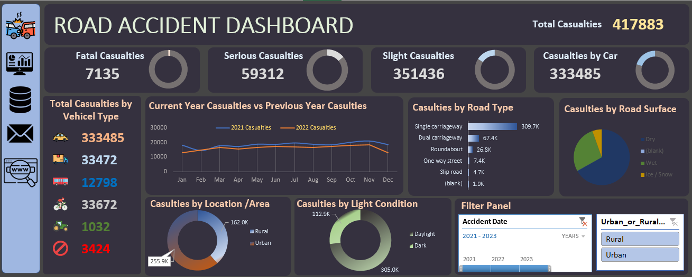

# 🚦 Road Accident Dashboard (Excel Project)

## 📌 Overview
The **Road Accident Dashboard** is an interactive Excel-based project designed to analyze accident data.  
It provides **real-time insights** into accident casualties categorized by **severity, vehicle type, road type, surface, location, and light conditions**.  

The goal is to **support policymakers, traffic authorities, and researchers** in identifying accident patterns and creating safer road strategies.

---

## 🖥️ Dashboard Preview

---

## 🎯 Key Features

### 🔹 High-Level KPIs
- **Total Casualties:** 417,883  
- **Fatal Casualties:** 7,135  
- **Serious Casualties:** 59,312  
- **Slight Casualties:** 351,436  

### 🔹 Breakdown by Categories
- **Casualties by Vehicle Type** → Cars, Vans, Buses, Bikes, Agriculture vehicles, Others  
- **Casualties by Road Type** → Single carriageway, Dual carriageway, Roundabout, One-way street, Slip road  
- **Casualties by Road Surface** → Dry, Wet, Ice/Snow  

### 🔹 Trend Analysis
- **Yearly comparison (2021 vs 2022)** of casualties using line chart  
- **Monthly accident patterns** to detect seasonal impact  
- **Casualties by Location** → Rural vs Urban  
- **Casualties by Light Condition** → Daylight vs Dark  

### 🔹 Interactivity
- Filter Panel includes:
  - Accident Date (2021–2023)  
  - Urban vs Rural selector  

---

## 📊 Insights from Data
- **Cars contribute the most casualties (333K+).**  
- **Urban areas (255K+) show higher casualties** compared to rural areas (162K).  
- **Daytime accidents (305K+) exceed night-time accidents.**  
- **Single carriageway roads (309K+) account for majority of cases.**  

---

## 🛠 Tools & Techniques Used
- **Microsoft Excel**
  - Pivot Tables & Pivot Charts  
  - Slicers & Filters for interactivity  
  - Conditional Formatting for KPIs  
- **Data Analysis**
  - Categorization by severity, location, vehicle type, road conditions  
  - Trend & time-series analysis  

---

## 📂 Project Files
- `Dataset` → Raw accident data  
- `Data Analysis Sheet` → Pivot tables & aggregations  
- `Dashboard` → Final interactive visualization  

---

## 🚀 How to Use
1. Clone/download this repository.  
2. Open the Excel file in **Microsoft Excel (2016 or later)**.  
3. Navigate to the **Dashboard tab**.  
4. Use the **filter panel** to slice data by **year, rural/urban, or road type**.  

---

## 💡 Future Enhancements
- Integration with **Power BI / Tableau** for advanced analytics.  
- Adding **Geo-mapping** to show accident hotspots.  
- Predictive modeling for **accident forecasting**.  

---

## 📌 Conclusion
This Road Accident Dashboard delivers **powerful accident insights** in a simple, interactive Excel dashboard.  
It empowers **decision-makers** to understand road safety challenges and take **preventive measures**.

---
👨‍💻 Developed by: **Akash Singh Rathour**

